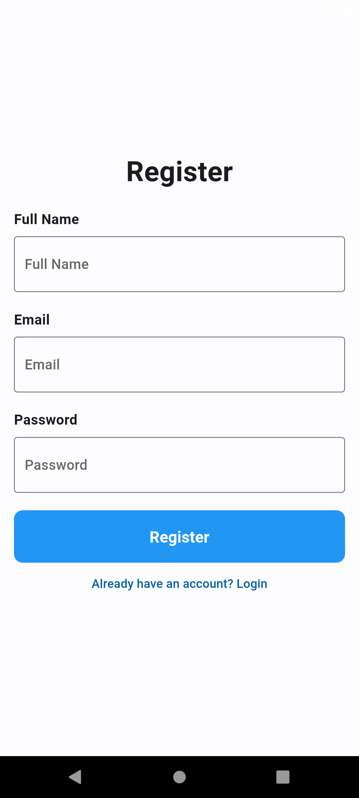
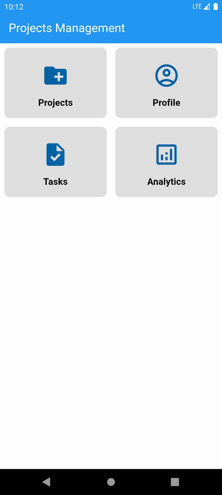
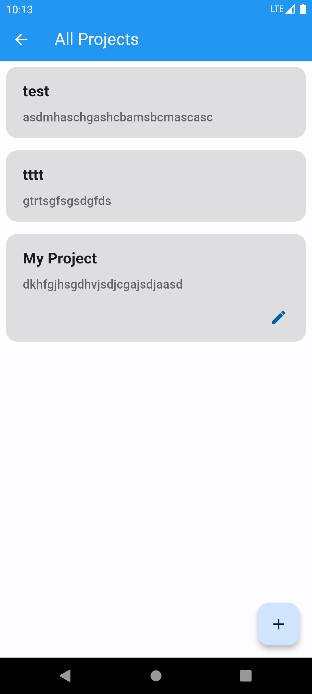
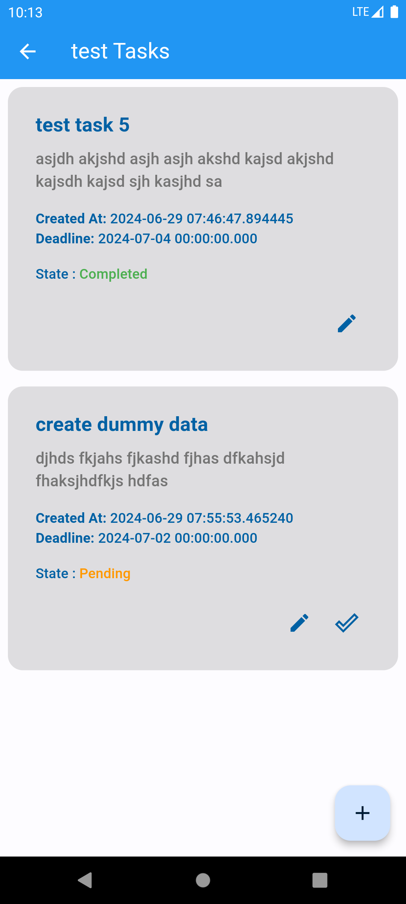
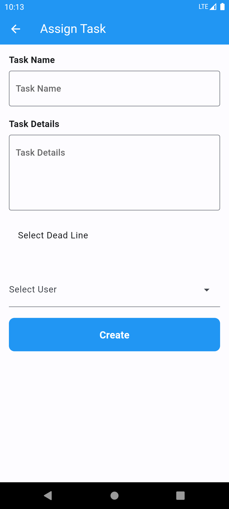
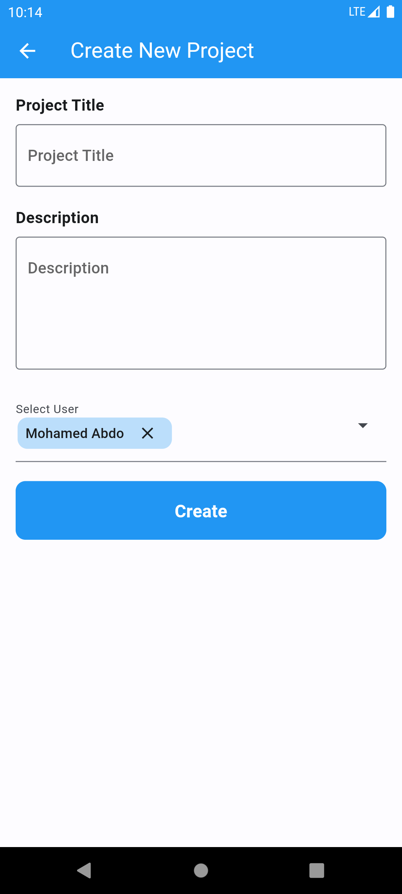
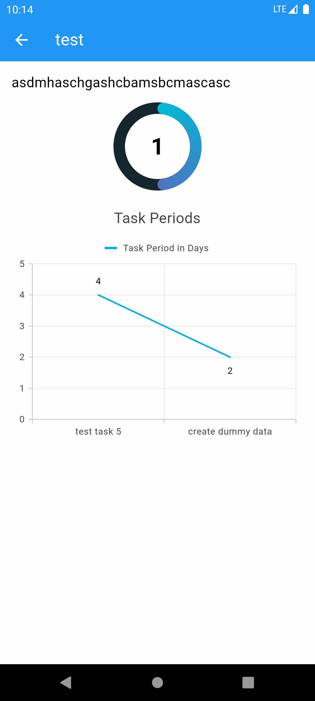

# Project Management Application

## Screen

<p align="center">
  
  
  
  
  
  
  
  
  
</p>
```
## Project Structure
## 1 - the project is implemented in flutter cross platform
## 2 - the code is structured in clean code using mvvm pattern
## 3 - the state management in the app is done by using Cubit state management
## 4 - project files as the following
       - core
       - features
         -- auth
            --- cubit
            --- model
            --- repository
            --- view
         -- home
         -- project
         -- tasks
         -- .
         -- .
       - service
         -- di
         -- local
```
## Database With Pros and Cons

1 - SQLite
    Pros: Lightweight and widely used.
    Cons: Limited scalability and may not be suitable for very large datasets or complex queries.
2 - Firebase Database
    Pros: Real-time synchronization, excellent Flutter integration, easy to use, and scalable.
    Cons: Cost can increase with scale, also not the best for complex queries.
3 - Hive
    Pros: Lightweight, fast, easy to use, and no native dependencies.
    Cons: Limited to local storage, not ideal for complex queries, also it's offline.
4 - PostgreSQL/MySQL
    Pros: Robust and scalable, supports complex queries and transactions.
    Cons: Requires a backend server, more complex setup and maintenance.

### In our project we have used firebase database as it's free for demo project with realtime changes also it does not require backend integration
### also provide many different authentication methods we have used (like email authentication) and the main important thing is tha it's secure.
### also the realtime may we need for large scale project to observe projects and tasks progress and observe tasks state changes over different platforms.
### Also We used Hive database to store local data inside the application as it's (lightweight, fast easy to use). the local data we store is like user data.